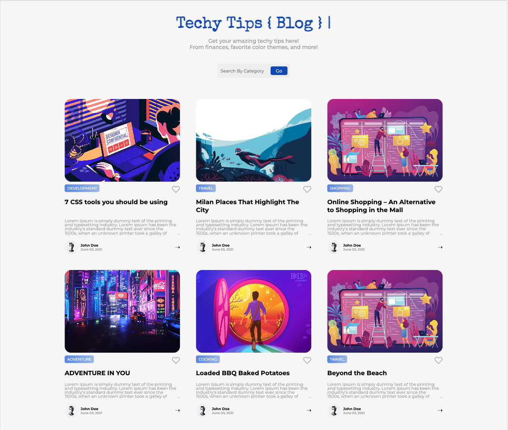
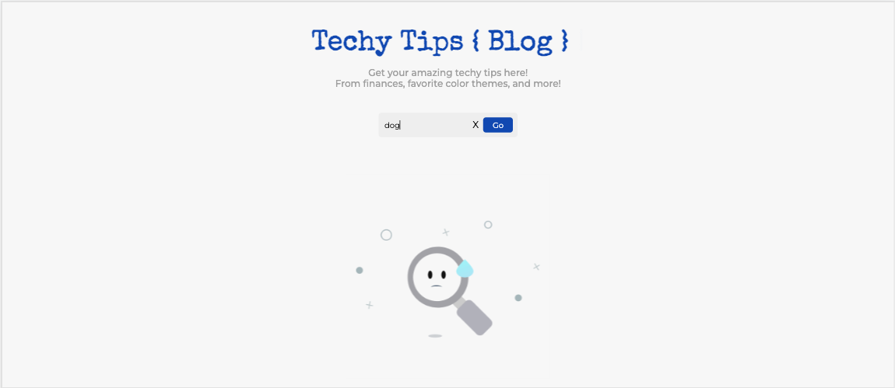

# A Clean Looking Blog Page

This modern Techy Tips theme is perfect for creating any kind of blog website from design, beauty, lifestyle, photography, travel, and lastly developer tips.

## Table of Contents:

- [Installation](#installation-start)
- [Usage](#usage)
- [Credits](#credits)
- [Features_Added-inProgress](#features)
- [tests](#tests)

---

## Installation

### Installation (start):

#### `npm start`

- Runs the app in the development mode.\
  Open [http://localhost:3000](http://localhost:3000) to view it in your browser.

- The page will reload when you make changes.\
  You may also see any lint errors in the console.

### Installation (test):

#### `npm test`

- Launches the test runner in the interactive watch mode.\
  See the section about [running tests](https://facebook.github.io/create-react-app/docs/running-tests) for more information.

### Installation (build):

#### `npm run build`

- Builds the app for production to the `build` folder.\
  It correctly bundles React in production mode and optimizes the build for the best performance.

- The build is minified and the filenames include the hashes.\
  Your app is ready to be deployed!

- See the section about [deployment](https://facebook.github.io/create-react-app/docs/deployment) for more information.

---

## Usage:

Screenshots and examples for how this application works.

### Home Page of Blog --

---

### Blog Pages by Id Clicked --

---

### Blog not Found by Category --

---

## Credits:

- [codeFreeze Youtube](https://www.youtube.com/watch?v=7kjud2ikReQ)
- [Heartbeat Animation](https://www.youtube.com/watch?v=JXJPbWQmptE)

---

## Features

### Added:

1. [ √ ] Typewriter Effect for Title using: `npm i typewriter-effect` : [Repository](github.com/tameemsafi/typewriterjs).
2. [ √ ] User Hearts Effect: used CSS and useStates so the user can toggle between liking a post and unliking a post.

---

### Progress for Front-End:

1. [ ] Cookies to a persons local machine to be able to store their data.
2. [ ] Create a login page for different users.
3. [ ] Different id's will be connected to different specific EJS files. In that case all Blog posts can have different appearances.
4. [ ] Will design my own characters for individual author posts.

---

### Progress for Back-End:

1. [ ] Build a RESTful API using Express and Knex
2. [ ] Use a PostgreSQL Database - Render.

---

## Tests:

Not currently implemented.
