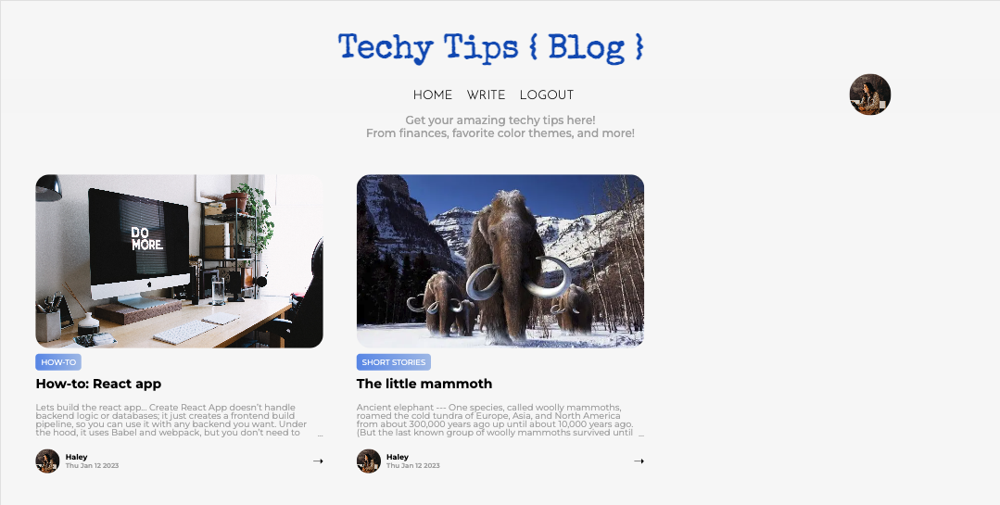
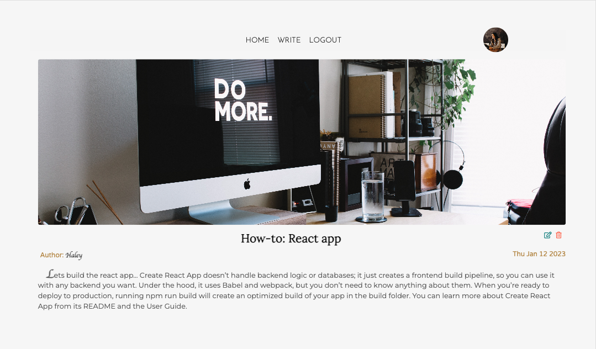
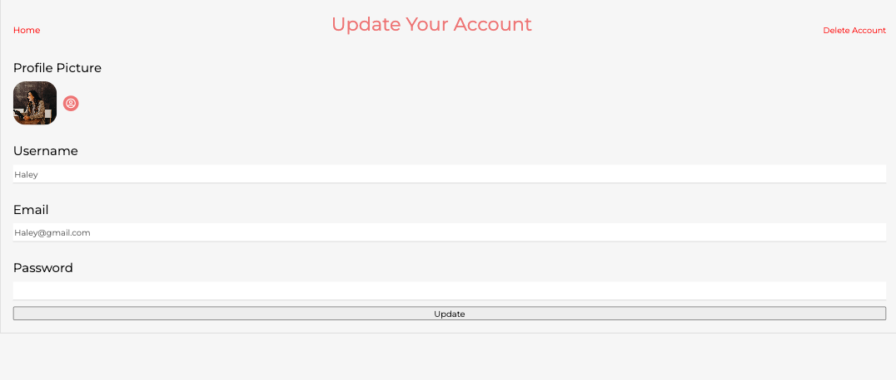
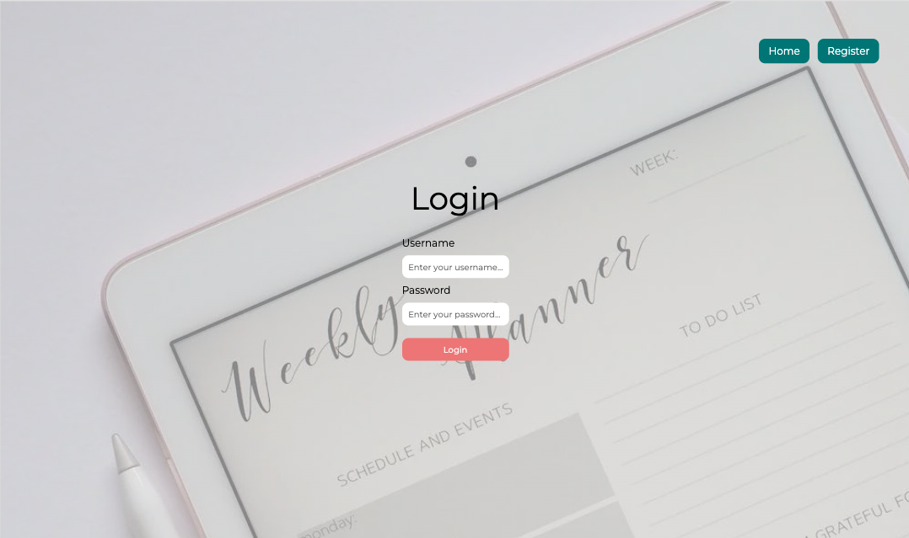

# A Clean Looking Blog Page

This modern Techy Tips theme is perfect for creating any kind of blog website from design, beauty, lifestyle, photography, travel, and lastly developer tips.

## Table of Contents:

- [Take me to: Techy Tips Blog](https://techytips.onrender.com)
- [Installation](#installation-start)
- [Usage](#usage)
- [Features](#features)

---

## Installation

### Installation (start):

#### `npm start`

- Runs the app in the development mode.\
  Open [http://localhost:3000](http://localhost:3000) to view it in your browser.

- The page will reload when you make changes.\
  You may also see any lint errors in the console.

### Installation (test):

#### `npm test`

- Launches the test runner in the interactive watch mode.\
  See the section about [running tests](https://facebook.github.io/create-react-app/docs/running-tests) for more information.

### Installation (build):

#### `npm run build`

- Builds the app for production to the `build` folder.\
  It correctly bundles React in production mode and optimizes the build for the best performance.

- The build is minified and the filenames include the hashes.\
  Your app is ready to be deployed!

- See the section about [deployment](https://facebook.github.io/create-react-app/docs/deployment) for more information.

---

## Usage:

Screenshots and examples for how this application works.

### Home Page of Blog --

---

### Individual Blog Post --

---

### Update User Settings --

---

### Login Page and Registration --

## Features

- [ √ ] Typewriter Effect for Title using: `npm i typewriter-effect` : [Repository](github.com/tameemsafi/typewriterjs).
- [ √ ] Create a login page for different users.
- [ √ ] Create a registration page for new users.
- [ √ ] Designed a settings page for users that have accounts to change name, photo, password.
